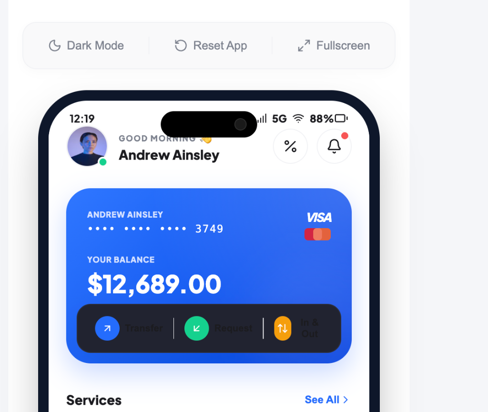

# SuperPay 📱 — Mobile E-Wallet Simulator

SuperPay is a beautiful, interactive, high-fidelity mobile e-wallet simulator built with **React** and **Vite**. It simulates a native mobile app interface inside a browser frame, featuring smooth animations, dark mode support, and realistic wallet operations.

🚀 **[Try the Live App Demo Here!](https://TabAh007.github.io/SuperPay-mobile-app/)**

---

## 📸 Screenshots

<p align="center">
  
</p>

---

## ✨ Features

- 🔄 **Onboarding Slides**: Swipeable introduction carousel detailing key benefits.
- 🔒 **Biometric Fingerprint Scan**: Simulated login flow with sensory animations.
- 💳 **Card Management**: View card details (CVV, Card Number) and toggle cards between active/frozen states.
- 💸 **Instant Transfers**: Simulate money transfers to contact lists with balance updates.
- 📈 **Interactive Statistics Chart**: Custom interactive SVG charts visualizing weekly expenditure.
- 🌓 **Dark Mode Toggle**: Sleek styling system for both light and dark mode modes.

---

## 🛠️ Tech Stack

- **Framework**: React 19 (Functional Components & Hooks)
- **Bundler**: Vite 8
- **Styling**: Modern CSS Custom Properties (variables) for native theme switching
- **Icons**: Lucide React

---

## 🚀 Running Locally

Follow these steps to run the project on your machine:

1. **Clone the repository**:
   ```bash
   git clone https://github.com/TabAh007/SuperPay-mobile-app.git
   cd SuperPay-mobile-app
   ```

2. **Install dependencies**:
   ```bash
   npm install
   ```

3. **Start the development server**:
   ```bash
   npm run dev
   ```

4. Open your browser and navigate to `http://localhost:5173`.
